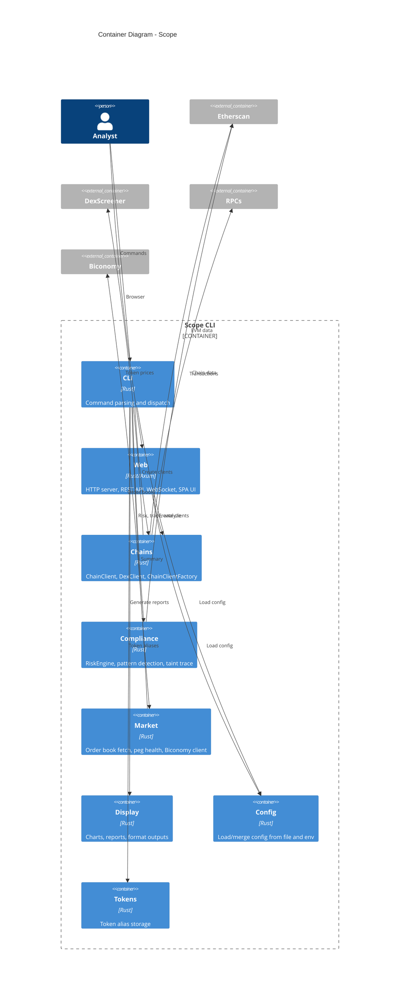

# Scope — C4 Container Diagram (Level 2)

High-level containers (modules) and their interactions.

## Container Responsibilities

| Container | Description |
|-----------|-------------|
| **CLI** | `clap` argument parsing, `Commands` dispatch, command handlers (address, tx, crawl, discover, monitor, token-health, portfolio, export, compliance, market, report, interactive, setup, web) |
| **Web** | Axum HTTP server, REST API handlers (`/api/*`), WebSocket live monitor (`/ws/monitor`), embedded SPA UI, daemon mode |
| **Chains** | `ChainClient` (Ethereum, Solana, Tron), `DexClient`, `ChainClientFactory`, balance/tx/token fetch |
| **Compliance** | `RiskEngine`, `BlockchainDataClient`, pattern analysis, transaction tracing |
| **Market** | `BiconomyClient`, `OrderBook`, `MarketSummary`, health checks |
| **Display** | ASCII charts, markdown reports (`report`, `address_report`), `format_risk_report` |
| **Config** | YAML load, env overrides, portfolio/monitor settings |
| **Tokens** | Token alias store (symbol → address) |
