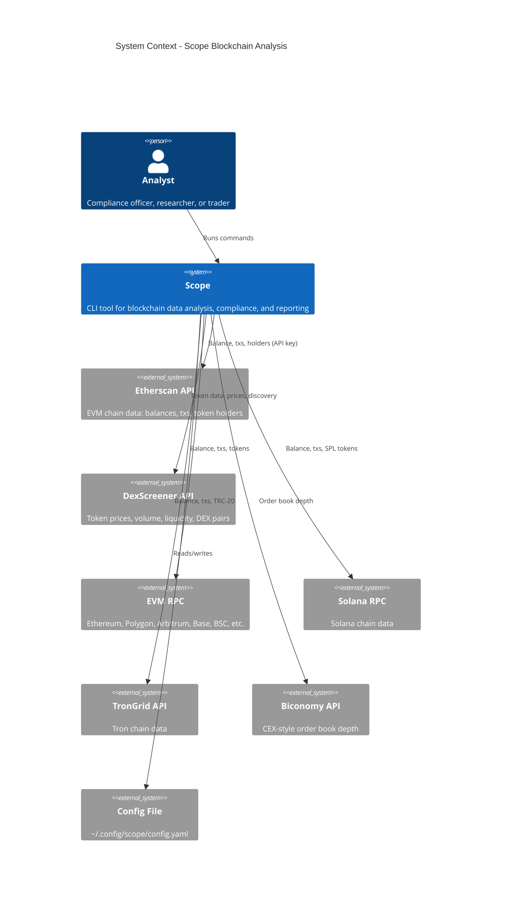

# Scope — C4 Context Diagram (Level 1)

System context: Scope and its external dependencies.

## External Systems

| System | Purpose |
|--------|---------|
| **Etherscan API** | EVM block explorer data; requires API key for compliance features |
| **DexScreener** | DEX token data, prices, search, trending/boosted discovery; no key required |
| **EVM RPC** | Direct chain queries (Infura, Alchemy, public RPC) |
| **Solana RPC** | Solana chain queries |
| **TronGrid** | Tron chain queries |
| **Biconomy** | CEX-style order book for stablecoin markets |
| **Config File** | API keys, RPC URLs, preferences |
