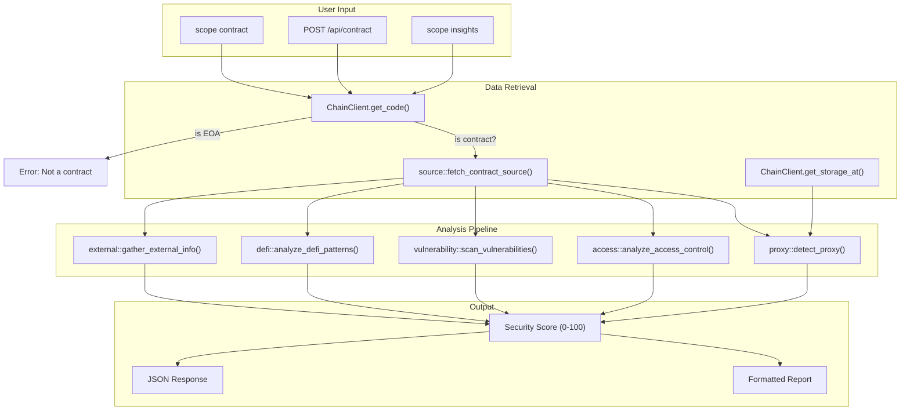

# Contract Analysis Architecture

## Overview

The contract analysis module (`src/contract/`) provides comprehensive smart contract security and intelligence analysis for EVM-compatible chains. It builds on Scope's existing `ChainClient` trait and Etherscan integration.

## Module Structure

```
src/contract/
├── mod.rs           # Orchestrator: runs full analysis pipeline, computes security score
├── source.rs        # Contract source retrieval from Etherscan (getsourcecode)
├── abi.rs           # ABI parsing, 4byte.directory lookup, calldata decoding
├── proxy.rs         # Proxy pattern detection (EIP-1967, EIP-1822, EIP-1167, Diamond)
├── access.rs        # Access control mapping (Ownable, AccessControl, tx.origin)
├── vulnerability.rs # Heuristic vulnerability scanning (reentrancy, selfdestruct, etc.)
├── defi.rs          # DeFi protocol analysis (oracles, flash loans, DEX, lending)
└── external.rs      # External intelligence (GitHub linking, audit reports, Sourcify)
```

## Dataflow Diagram



## Security Scoring

The security score (0-100) is computed from multiple factors:

| Factor | Impact |
|--------|--------|
| Source verified | +15 |
| Source NOT verified | -20 |
| Is proxy | -5 |
| Admin identifiable | +3 |
| Ownership renounced | +10 |
| Role-based access | +5 |
| Uses tx.origin | -15 |
| Critical vulnerability | -20 each |
| High vulnerability | -12 each |
| Medium vulnerability | -6 each |
| Oracle dependency | -5 |
| Flash loan risk | -8 |
| Audit reports found | +15 |
| GitHub repo found | +5 |

## External APIs Used

| API | Endpoint | Auth | Purpose |
|-----|----------|------|---------|
| Etherscan V2 | `getsourcecode` | API key (free tier) | Source code, ABI, metadata |
| Etherscan V2 | `eth_getStorageAt` | API key (free tier) | EIP-1967 proxy slots |
| OpenChain | `/signature-database/v1/lookup` | None | Function signature resolution |
| 4byte.directory | `/api/v1/signatures/` | None | Function signature fallback |
| Sourcify | `/server/check-all-by-addresses` | None | Cross-verification status |

## Risk Detection Enhancements

The `compliance/risk.rs` module was extended with contract-aware risk factors:

- **Gini coefficient** for holder concentration analysis
- **Rugpull indicators** (owner can mint/pause/blacklist, unverified, honeypot patterns)
- **Whale detection** (large transaction threshold analysis)
- **Timelock detection** (TimelockController, queue/delay/execute patterns)
- **Multisig detection** (Gnosis Safe bytecode, multi-owner threshold patterns)

## CLI Usage

```bash
# Basic contract analysis
scope contract 0xdAC17F958D2ee523a2206206994597C13D831ec7

# Specify chain
scope contract 0xA0b86991c6218b36c1d19D4a2e9Eb0cE3606eB48 --chain ethereum

# JSON output
scope contract 0x7a250d5630B4cF539739dF2C5dAcb4c659F2488D --json
```

## Web API

```bash
curl -X POST http://localhost:8080/api/contract \
  -H "Content-Type: application/json" \
  -d '{"address": "0xdAC17F958D2ee523a2206206994597C13D831ec7", "chain": "ethereum"}'
```

## Web UI

The web interface (`scope web`) includes a dedicated **Contract Analysis** panel:

- **Navigation:** "Contract" button in the nav bar (4th from left)
- **Inputs:** Contract address and chain selector
- **Rich rendering:** Security score circle with color coding, source info grid, proxy detection, access control with privileged function table, severity-colored vulnerability cards, DeFi analysis with oracle/DEX integration details, and external intelligence links
- **Downloads:** JSON, CSV (vulnerability export), and Markdown report formats

The panel calls `POST /api/contract` which delegates to `contract::analyze_contract()`.

## Interactive Mode

Contract analysis is available in interactive mode:

```text
scope:ethereum> contract 0xdAC17F958D2ee523a2206206994597C13D831ec7
scope:ethereum> ct 0xA0b86991... --chain=polygon --json
```
