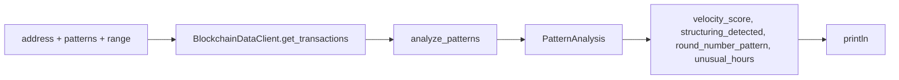
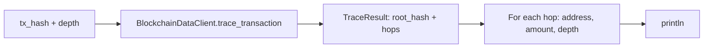
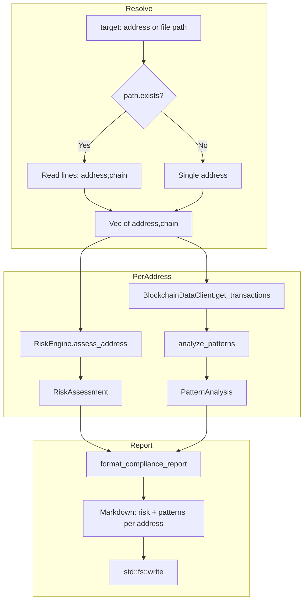

# Compliance Dataflow

Dataflow for `scope compliance risk`, `analyze`, `trace`, and `compliance-report`.

## Risk Assessment (`scope compliance risk`)

```mermaid
flowchart TB
    subgraph Input
        A[CLI: address, chain?, format, detailed, output?]
        A --> B[detect_chain or use --chain]
    end

    subgraph Engine
        B --> C{ETHERSCAN_API_KEY?}
        C -->|Yes| D[RiskEngine.with_data_client]
        C -->|No| E[RiskEngine.new]
        D --> F[assess_address]
        E --> F
    end

    subgraph Assess
        F --> G[BlockchainDataClient.get_transactions]
        G --> H[analyze_patterns]
        H --> I[Risk factors: behavioral, association, etc.]
        I --> J[RiskAssessment]
    end

    subgraph Output
        J --> K[format_risk_report: table|json|yaml|markdown]
        K --> L[println]
        J --> M{--output?}
        M -->|Some| N[Write to file by extension]
    end

    subgraph External
        G --> O[Etherscan API]
    end
```

## Pattern Analysis (`scope compliance analyze`)



## Transaction Trace (`scope compliance trace`)



## Unified Compliance Report (`scope compliance compliance-report`)


