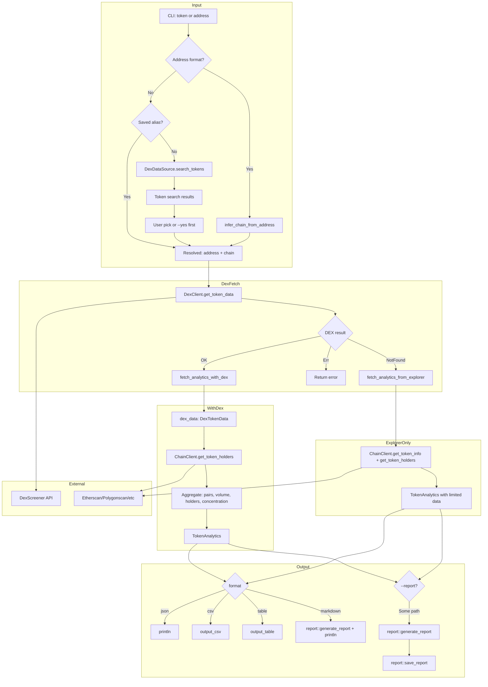

# Token Crawl Dataflow

Dataflow for `scope crawl [TOKEN] [OPTIONS]` — fetches DEX and block-explorer data, aggregates into TokenAnalytics.

## Data Sources

| Source | Data |
|--------|------|
| **DexScreener** | price, volume (1h/6h/24h), liquidity, pairs, price_history, volume_history |
| **Block Explorer** | token holders, holder percentages |
| **Fallback** | When no DEX pairs: explorer-only TokenAnalytics |

## Architecture Note

Token resolution uses `DexDataSource` from the factory for search, enabling dependency injection and testability. Both `crawl::run` and `crawl::fetch_analytics_for_input` pass the factory's dex client to `resolve_token_input`.

## TokenAnalytics Fields

- token (symbol, name, address), chain
- holders, total_holders, top_*_concentration
- volume_24h, volume_7d, liquidity_usd
- price_usd, price_change_*, price_history
- dex_pairs, market_cap, fdv
- total_buys/sells_*h, token_age_hours
- socials, websites, image_url
