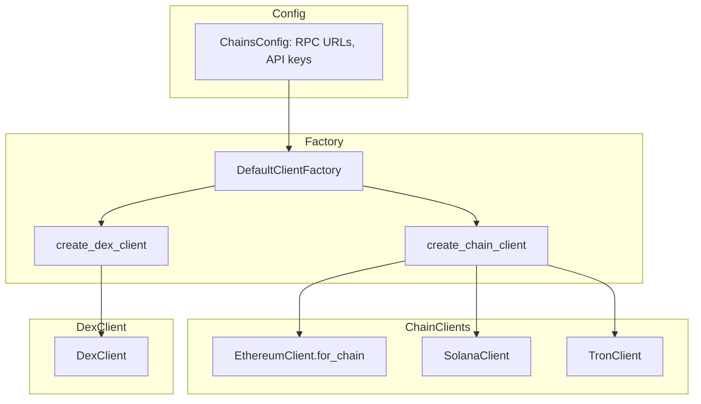
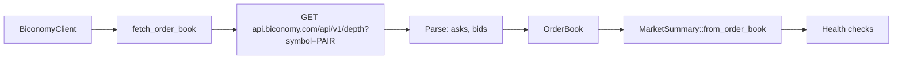

# Data Sources Dataflow

How Scope fetches data from external systems.

## ChainClientFactory → Clients



## ChainClient Capabilities by Chain

| Chain | Balance | Transactions | Token Balances | Holder Count | Token Info |
|-------|---------|--------------|----------------|--------------|------------|
| Ethereum | RPC | Etherscan | Etherscan | Etherscan | Etherscan |
| Polygon | RPC | Polygonscan | Polygonscan | Polygonscan | Polygonscan |
| Arbitrum | RPC | Arbiscan | Arbiscan | Arbiscan | Arbiscan |
| Solana | RPC | RPC | RPC (SPL) | Solscan | — |
| Tron | TronGrid | TronGrid | TronGrid (TRC-20) | Tronscan | — |

## DexScreener Flow

```mermaid
flowchart LR
    A[get_token_data] --> B[GET /latest/dex/tokens/ADDRESS]
    B --> C[Filter pairs by chain]
    C --> D[Aggregate: volume, liquidity, price]
    D --> E[DexTokenData]
    
    F[get_native_token_price] --> G[Known pair addresses per chain]
    G --> H[Extract price from pair data]
    
    I[search_tokens] --> J[GET /latest/dex/search?q=QUERY]
    J --> K[TokenSearchResult[]]
```

## Compliance Data Source (Etherscan)

```mermaid
flowchart LR
    A[BlockchainDataClient] --> B[get_transactions]
    B --> C[GET api.etherscan.io?module=account&action=txlist]
    C --> D[EtherscanTransaction[]]
    
    A --> E[trace_transaction]
    E --> F[Follow tx graph by hash]
    F --> G[TraceHop[]]
```

## Biconomy Order Book


