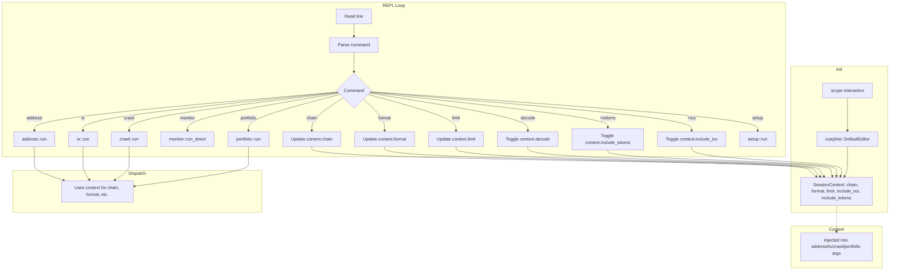

# Interactive Mode Dataflow

Dataflow for `scope interactive` — REPL with persistent context.

## Context Persistence

| Setting | Default | Commands that use it |
|---------|---------|----------------------|
| chain | ethereum | address, tx, crawl, monitor |
| format | table | address, tx, crawl, portfolio |
| limit | 100 | address (tx count) |
| decode | false | tx |
| include_txs | false | address |
| include_tokens | false | address |
| last_address | — | address (when no arg) |
| last_tx | — | tx (when no arg) |
