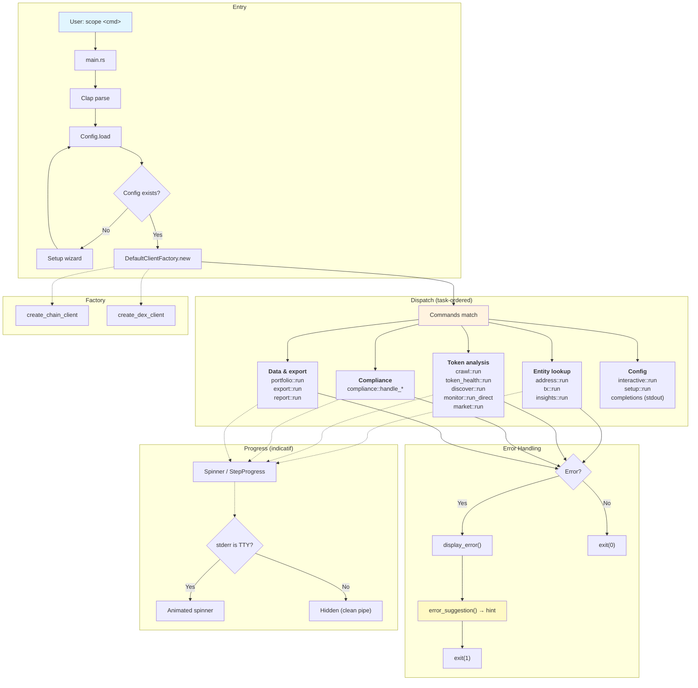

# Main Application Dataflow

High-level flow from CLI entry to command execution.

## Flow Summary

1. **Parse** — CLI args → `Commands` enum (with typo suggestions and `after_help` examples)
2. **Config** — Load `~/.config/scope/config.yaml`, merge with env
3. **Factory** — Build `DefaultClientFactory` with chain config
4. **Dispatch** — Match command (ordered by task group), call handler with config + factory
5. **Progress** — Each handler creates `Spinner` or `StepProgress` for long operations; auto-hides in pipes
6. **Handler** — Uses factory for chain/DEX clients, config for output preferences
7. **Error handling** — `display_error()` prints error + `error_suggestion()` hint (invalid address, missing config, network, auth)
8. **Completions** — `scope completions <shell>` generates shell script to stdout (no factory needed)
