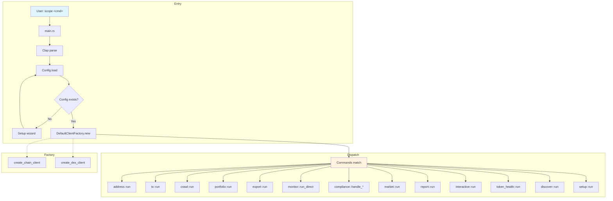

# Main Application Dataflow

High-level flow from CLI entry to command execution.

## Flow Summary

1. **Parse** — CLI args → `Commands` enum
2. **Config** — Load `~/.config/scope/config.yaml`, merge with env
3. **Factory** — Build `DefaultClientFactory` with chain config
4. **Dispatch** — Match command, call handler with config + factory
5. **Handler** — Uses factory for chain/DEX clients, config for output preferences
