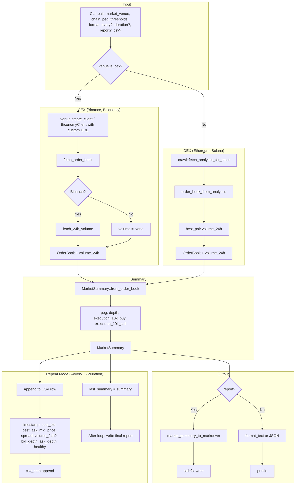

# Market Summary Dataflow

Dataflow for `scope market summary [SYMBOL] [OPTIONS]` — peg, order book health, volume, and execution checks.

**Venues:** Binance (default), Biconomy, Ethereum DEX, Solana DEX. CEX uses REST depth APIs; DEX synthesizes from DexScreener via `crawl::fetch_analytics_for_input`.

## Venues

| Venue   | Symbol format | Volume 24h        | Execution check                  |
|---------|---------------|-------------------|----------------------------------|
| Binance | USDCUSDT      | Ticker 24hr       | Order book walk (10k USDT)       |
| Biconomy| USDC_USDT     | —                 | Order book walk                  |
| Ethereum| DEX           | DexPair.volume_24h | Synthesized book walk            |
| Solana  | DEX           | DexPair.volume_24h | Synthesized book walk            |

## Health Checks

| Check | Description |
|-------|-------------|
| No sells below peg | Ask levels below peg_target flagged |
| Bid/ask ratio | Depth ratio within min/max |
| Min levels | At least N levels per side |
| Min depth | Total depth ≥ threshold |

## Volume & Execution

- **Volume 24h:** From Binance ticker (`quoteVolume`) or DEX pair analytics. Omitted for Biconomy.
- **Execution 10k:** Simulates buying/selling 10k USDT by walking the order book; reports slippage in bps or "insufficient liquidity".
