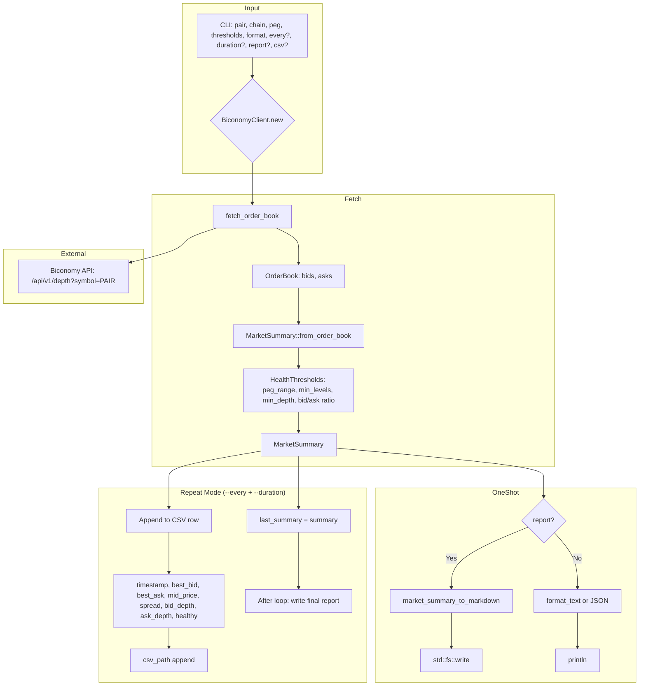

# Market Summary Dataflow

Dataflow for `scope market summary [PAIR] [OPTIONS]` — peg and order book health.

## Health Checks

| Check | Description |
|-------|-------------|
| No sells below peg | Ask levels below peg_target flagged |
| Bid/ask ratio | Depth ratio within min/max |
| Min levels | At least N levels per side |
| Min depth | Total depth ≥ threshold |
