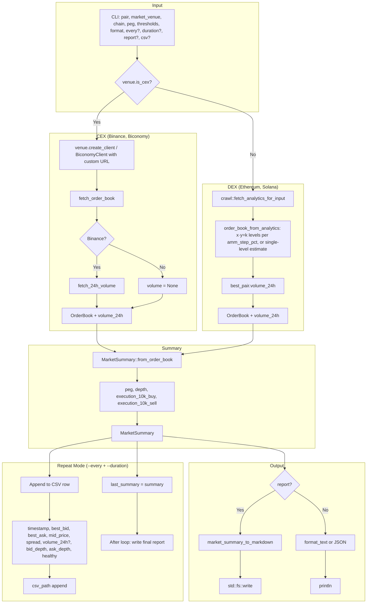

# Market Summary Dataflow

Dataflow for `scope market summary [SYMBOL] [OPTIONS]` — peg, order book health, volume, and execution checks.

**Venues:** Binance (default), Biconomy, Ethereum DEX, Solana DEX. CEX uses REST depth APIs; DEX synthesizes from DexScreener via `crawl::fetch_analytics_for_input`.

```mermaid
flowchart TB
    subgraph Input
        A[CLI: pair, market_venue, chain, peg, thresholds, format, every?, duration?, report?, csv?]
        A --> B{venue.is_cex?}
    end

    subgraph CEX["CEX (Binance, Biconomy)"]
        B -->|Yes| C1[venue.create_client / BiconomyClient with custom URL]
        C1 --> C2[fetch_order_book]
        C2 --> C3{Binance?}
        C3 -->|Yes| C4[fetch_24h_volume]
        C3 -->|No| C5[volume = None]
        C4 --> C6[OrderBook + volume_24h]
        C5 --> C6
    end

    subgraph DEX["DEX (Ethereum, Solana)"]
        B -->|No| D1[crawl::fetch_analytics_for_input]
        D1 --> D2[order_book_from_analytics: x·y=k levels per amm_step_pct, or single-level estimate]
        D2 --> D3[best_pair.volume_24h]
        D3 --> D4[OrderBook + volume_24h]
    end

    subgraph Summary
        C6 --> E[MarketSummary::from_order_book]
        D4 --> E
        E --> F[peg, depth, execution_10k_buy, execution_10k_sell]
        F --> G[MarketSummary]
    end

    subgraph Output
        G --> H{report?}
        H -->|Yes| I[market_summary_to_markdown]
        I --> J[std::fs::write]
        H -->|No| K[format_text or JSON]
        K --> L[println]
    end

    subgraph RepeatMode["Repeat Mode (--every + --duration)"]
        G --> M[Append to CSV row]
        M --> N[timestamp, best_bid, best_ask, mid_price, spread, volume_24h?, bid_depth, ask_depth, healthy]
        N --> O[csv_path append]
        G --> P[last_summary = summary]
        P --> Q[After loop: write final report]
    end
```

## Venues

| Venue   | Symbol format | Volume 24h        | Execution check                  |
|---------|---------------|-------------------|----------------------------------|
| Binance | USDCUSDT      | Ticker 24hr       | Order book walk (10k USDT)       |
| Biconomy| USDC_USDT     | —                 | Order book walk                  |
| Ethereum| DEX           | DexPair.volume_24h | Synthetic AMM book walk          |
| Solana  | DEX           | DexPair.volume_24h | Synthetic AMM book walk          |

### Synthetic DEX book (#37)

A DEX pool has no level-2 book. `order_book_from_analytics` builds one:

- **`BookSource::SyntheticAmm`** when DexScreener reports the base reserve `x0` (`liquidity.base`). The pool holds `x(P) = x0·√(P0/P)` base at price `P` (constant product). One level sits at each `amm_step_pct` step from the price, out to the outlier band (peg ± `peg_range`×5) and to at least 10 steps, so top-10 depth is defined. A level's quantity is the base the pool buys (bids) or sells (asks) between two steps.
- **`BookSource::SyntheticEstimate`** when the reserve is missing: one level per side at ±0.1% holding half the pool's USD liquidity. The usual rules apply, and the output labels the book as an estimate.
- Concentrated-liquidity (v3) pools are treated as constant product. Exact v3 depth needs on-chain tick data, which DexScreener does not supply.

## Health Checks

| Check | Description |
|-------|-------------|
| No sells below peg | Ask levels below peg_target flagged |
| Bid/ask ratio | Depth ratio within min/max |
| Min levels | At least N valid levels (price > 0, qty > 0) per side (default 10) |
| Max spread | Best valid bid/ask spread ≤ N% of mid (default 3%) |
| Min depth | Total in-band depth ≥ threshold (default 3000) |
| Top-3 depth | Sum of top 3 valid levels ≥ threshold per side (default 300) |
| Top-10 depth | Sum of top 10 valid levels ≥ threshold per side (default 2000) |

Each check is `pass`, `fail` or `n/a`. On a `SyntheticAmm` book, *min levels* and *max spread* are `n/a`: the step sets the level count, and the real spread is the pool fee, which the data source does not report. `n/a` checks are always shown and are left out of `healthy`. JSON: `{"status": "pass" | "fail" | "n/a", "message": "…"}`.

## Volume & Execution

- **Volume 24h:** From Binance ticker (`quoteVolume`) or DEX pair analytics. Omitted for Biconomy.
- **Execution 10k:** Simulates buying/selling 10k USDT by walking the order book; reports slippage in bps or "insufficient liquidity".
