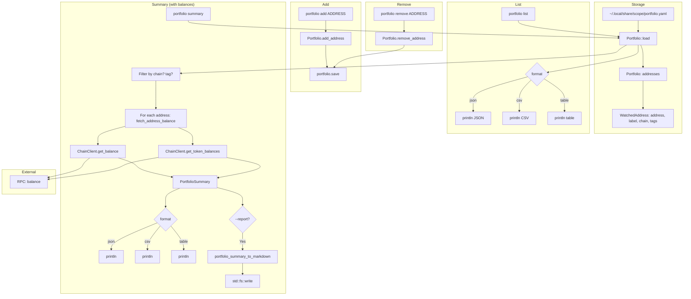

# Portfolio Dataflow

Dataflow for `scope portfolio` subcommands: add, remove, list, summary.

```mermaid
flowchart TB
    subgraph Storage
        A[~/.local/share/scope/portfolio.yaml]
        A --> B[Portfolio::load]
        B --> C[Portfolio: addresses]
        C --> D[WatchedAddress: address, label, chain, tags]
    end

    subgraph Add
        E[portfolio add ADDRESS] --> F[Portfolio.add_address]
        F --> G[portfolio.save]
    end

    subgraph Remove
        H[portfolio remove ADDRESS] --> I[Portfolio.remove_address]
        I --> G
    end

    subgraph List
        J[portfolio list] --> B
        B --> K{format}
        K -->|json| L[println JSON]
        K -->|csv| M[println CSV]
        K -->|table| N[println table]
    end

    subgraph Summary["Summary (with balances)"]
        O[portfolio summary] --> B
        B --> P[Filter by chain? tag?]
        P --> Q[For each address: fetch_address_balance]
        Q --> R[ChainClient.get_balance]
        Q --> S[ChainClient.get_token_balances]
        R --> T[PortfolioSummary]
        S --> T
        T --> U{format}
        U -->|json| V[println]
        U -->|csv| W[println]
        U -->|table| X[println]
        T --> Y{--report?}
        Y -->|Yes| Z[portfolio_summary_to_markdown]
        Z --> AA[std::fs::write]
    end

    subgraph External
        R --> AB[RPC: balance]
        S --> AB
    end
```
