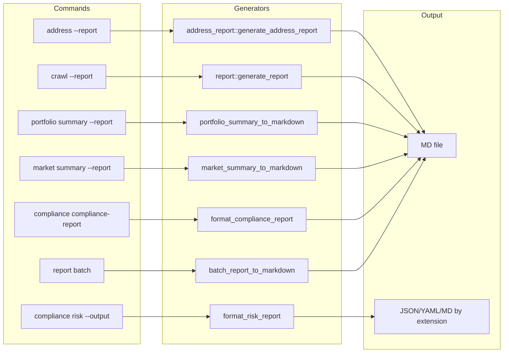
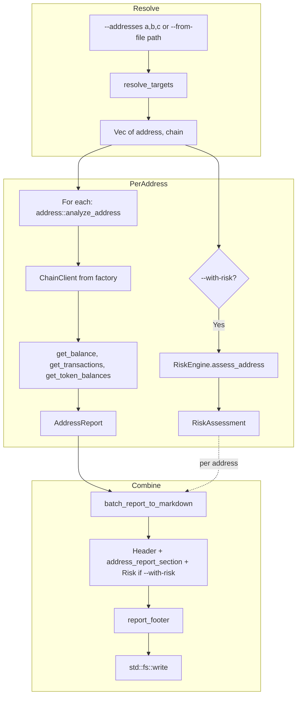

# Report Generation Dataflow

Dataflow for all report-generating commands and the batch report.

## Report Types Overview



## Report Batch Dataflow



## Report Footer (Versioning)

All reports include:

```
---
*Report generated by Scope vX.Y.Z at YYYY-MM-DD HH:MM:SS UTC. Always verify data from primary sources.*
```

From `display::report::report_footer()`.
