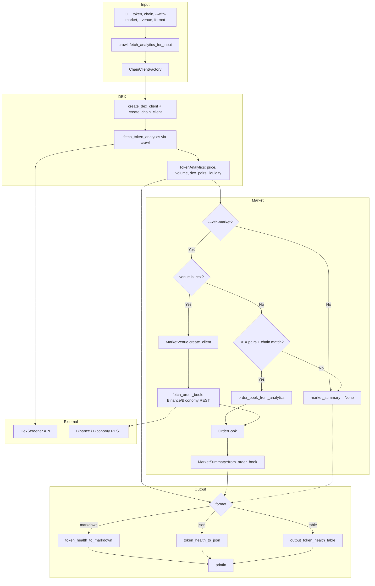

# Token Health Dataflow

Dataflow for `scope token-health [TOKEN]` and `scope health [TOKEN]` — composite DEX analytics + optional market/order book.

**Venues:** CEX (Binance, Biconomy) or DEX (Ethereum, Solana) synthesized from DexScreener liquidity.

## Venue Routing

| Venue | Type | Source | Pair format |
|-------|------|--------|-------------|
| binance | CEX | Binance Spot REST | USDCUSDT |
| biconomy | CEX | Biconomy REST | USDC_USDT |
| eth | DEX | DexScreener liquidity | Synthesized from best pair |
| solana | DEX | DexScreener liquidity | Synthesized from best pair |

## Config Override

When `--ai` is set (or `config.output.format == Markdown`), output format is forced to markdown for agent/LLM consumption.
