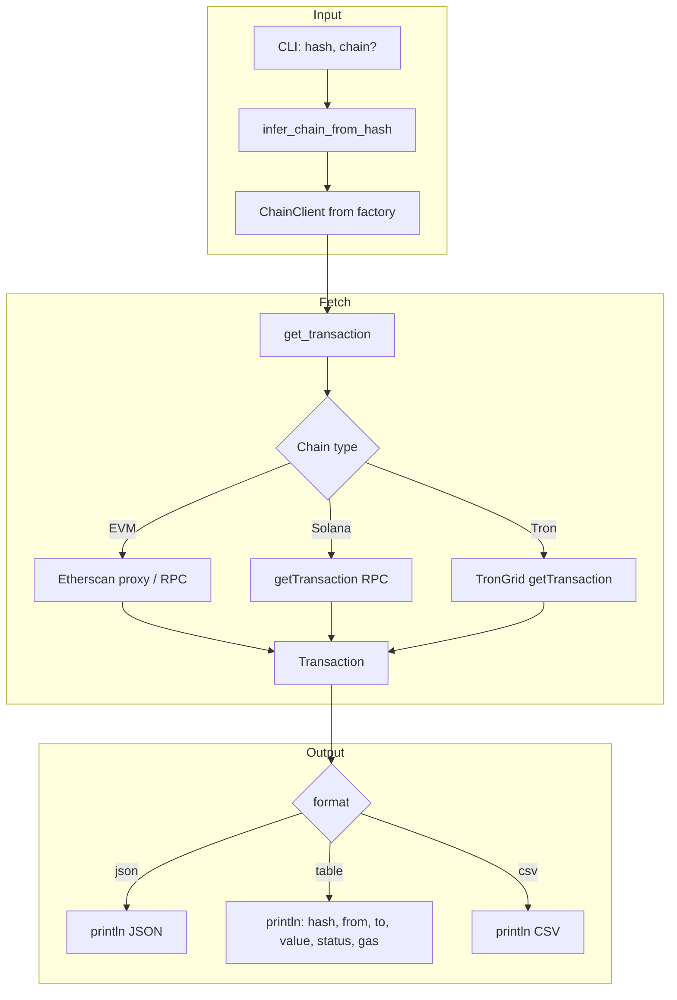

# Transaction Command Dataflow

Dataflow for `scope tx [HASH]`.

## Transaction Fields

- hash, block_number, timestamp
- from, to, value
- gas_limit, gas_used, gas_price
- status (success/failure)
- input (calldata)
