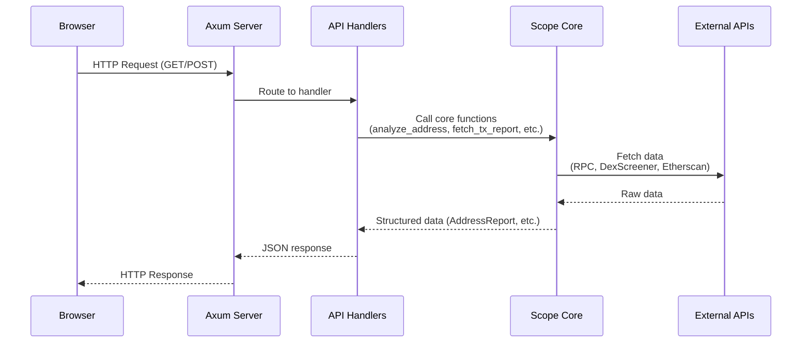
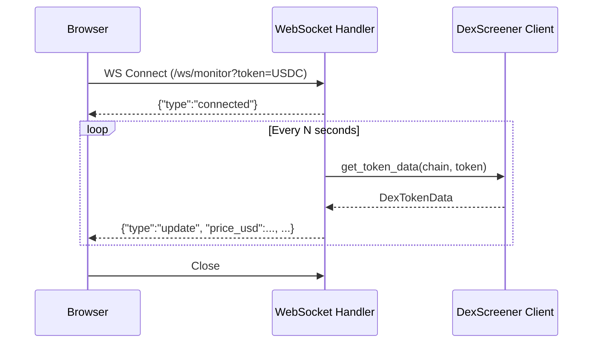
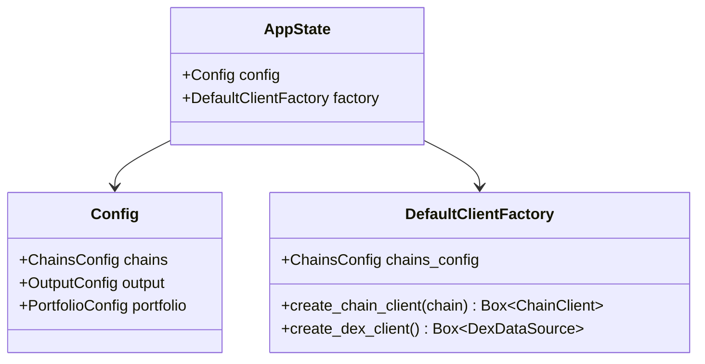
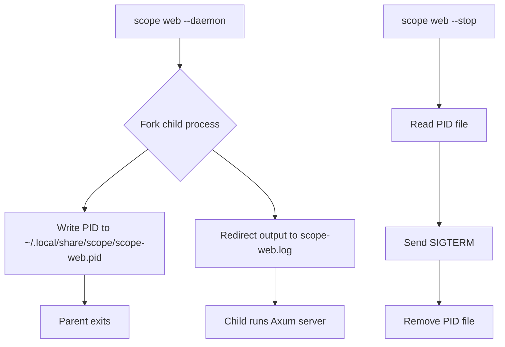

# Web Mode Data Flow

## Overview

The web mode (`scope web`) starts a local HTTP server that mirrors all CLI functionality
through a REST API and single-page web UI. It reuses the same `Config` and `DefaultClientFactory`
as the CLI, ensuring identical behavior.

## Request Flow

## WebSocket Monitor Flow

## API Endpoints

| Endpoint                    | Method | Handler                     | Core Function                    |
|-----------------------------|--------|-----------------------------|----------------------------------|
| `GET /`                     | GET    | `serve_ui`                  | Static HTML/CSS/JS               |
| `POST /api/address`         | POST   | `api::address::handle`      | `address::analyze_address`       |
| `POST /api/tx`              | POST   | `api::tx::handle`           | `tx::fetch_transaction_report`   |
| `POST /api/insights`        | POST   | `api::insights::handle`     | `insights::infer_target` + core  |
| `POST /api/crawl`           | POST   | `api::crawl::handle`        | `crawl::fetch_analytics_for_input` |
| `GET /api/discover`         | GET    | `api::discover::handle`     | `DexClient::get_token_profiles`  |
| `POST /api/token-health`    | POST   | `api::token_health::handle` | `crawl::fetch_analytics_for_input` + market |
| `POST /api/market/summary`  | POST   | `api::market::handle`       | `OrderBookClient::fetch_order_book` |
| `POST /api/exchange/snapshot` | POST | `api::exchange::handle`    | Full market snapshot (order book, ticker, trades) |
| `POST /api/exchange/ohlc`   | POST   | `api::exchange::handle_ohlc` | OHLC/candlestick data for venue/pair |
| `POST /api/exchange/trades` | POST   | `api::exchange::handle_trades` | Recent trades for venue/pair |
| `GET /api/portfolio/list`   | GET    | `api::portfolio::handle_list` | `Portfolio::load`              |
| `POST /api/portfolio/add`   | POST   | `api::portfolio::handle_add`  | `Portfolio::add_address`       |
| `POST /api/export`          | POST   | `api::export::handle`       | `ChainClient::get_*`             |
| `POST /api/compliance/risk` | POST   | `api::compliance::handle_risk` | `RiskEngine::assess_address`  |
| `GET /api/config/status`    | GET    | `api::config_status::handle`  | Config inspection              |
| `POST /api/config`          | POST   | `api::config_status::handle_save` | Config write               |
| `WS /ws/monitor`            | WS     | `monitor::ws_handler`       | `DexDataSource::get_token_data`  |

## Application State

## Daemon Mode

## Security

- **Bind**: `127.0.0.1` by default (localhost only)
- **Auth**: None (local use only)
- **API Keys**: Stored on disk, never exposed to browser
- **CORS**: Permissive (same-origin expected)
