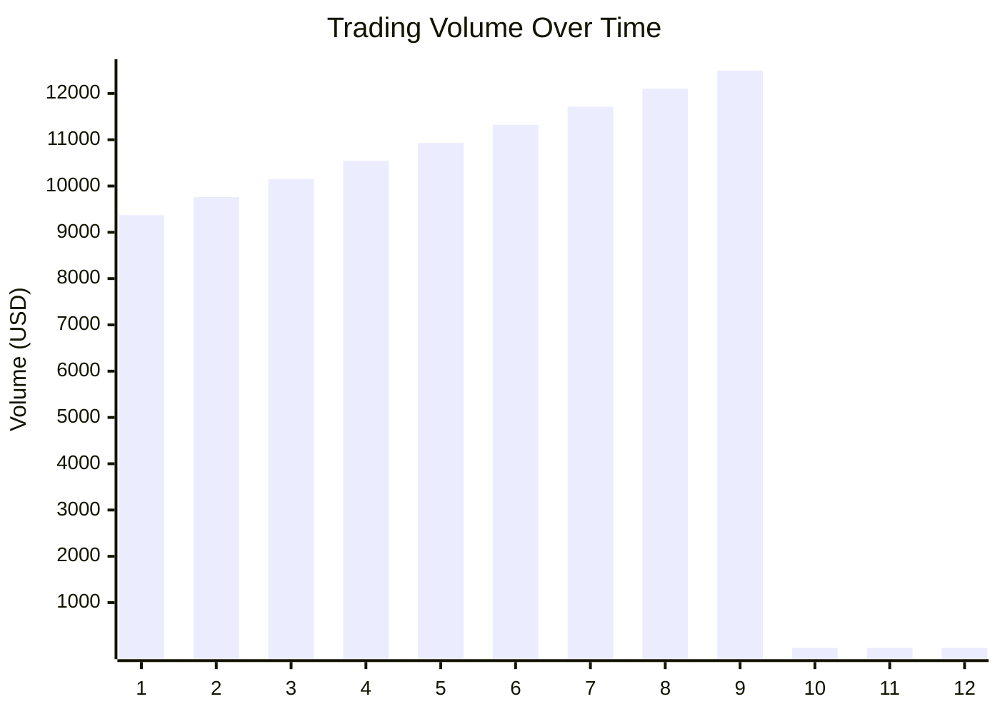
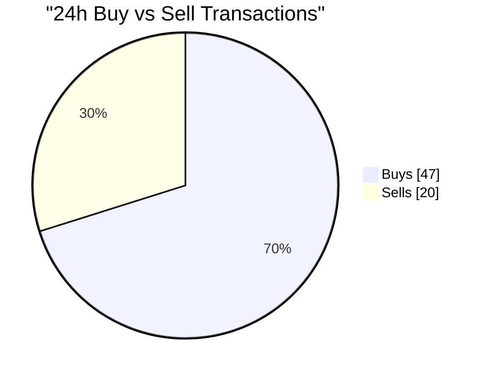
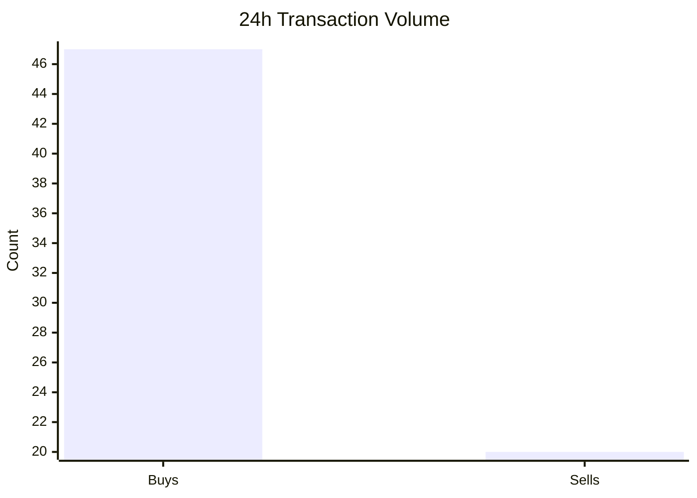
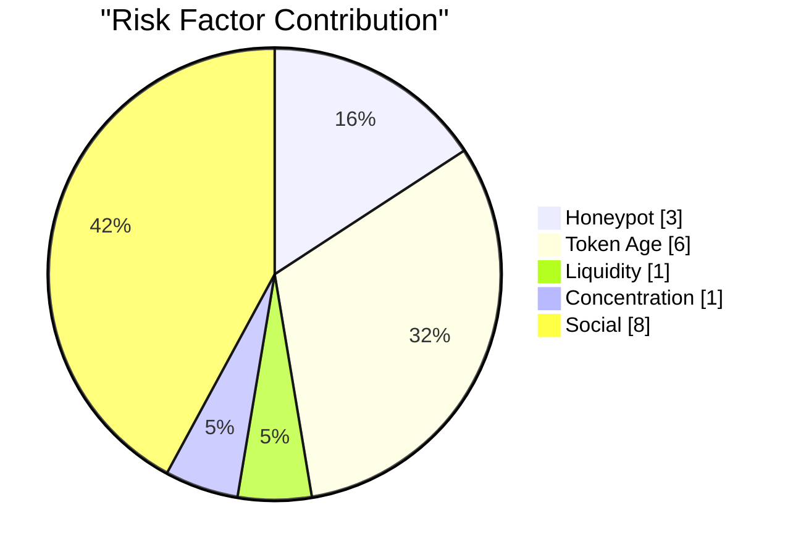

# Token Analysis Report: USDC 

**Token Name:** USD Coin   
**Chain:** Solana  
**Generated:** 2026-02-06 15:31:38 UTC  
**Contract:** `7LDc3uqTSvVKDWPLiJGkNfCZQmavfhezY3sAoNUEJ9Yw`

---

## Executive Summary

| Metric | Value |
|--------|-------|
| Price | $1.001300 |
| 24h Change | +0.00% |
| 7d Change | +0.00% |
| 24h Volume | $281K |
| 7d Volume | $1.97M |
| Liquidity | $1.41B |
| Market Cap | $76.24B |
| Fully Diluted Valuation | $76.24B |
| Total Holders | 0 |

---

## Price Analysis

**Current Price:** $1.001300

### Price Changes

| Period | Change |
|--------|--------|
| 24 Hours | +0.00% |
| 7 Days | +0.00% |

### Price Range (Period)

| Stat | Value |
|------|-------|
| High | $1.001300 |
| Low | $1.001300 |
| Average | $1.001300 |

### Price History

```mermaid
xychart-beta
    title "Price Over Time"
    x-axis ["1", "2", "3", "4", "5", "6", "7", "8", "9"]
    y-axis "Price (USD)"
    line [1.001300, 1.001300, 1.001300, 1.001300, 1.001300, 1.001300, 1.001300, 1.001300, 1.001300]
```

---

## Volume Analysis

| Period | Volume |
|--------|--------|
| 24 Hours | $281K |
| 7 Days | $1.97M |

**Volume/Liquidity Ratio (24h):** 0.00x

### Volume Chart



---

## Liquidity Analysis

**Total Liquidity:** $1.41B

### Trading Pairs

| DEX | Pair | Liquidity | 24h Volume | Price |
|-----|------|-----------|------------|-------|
| raydium | USDC /USDT | $1.41B | $281K | $1.001300 |

---

## Top Holders

*No holder data available*

---

## Concentration Analysis

- **Top 10 holders control:** -0.0% of supply
- **Top 50 holders control:** -0.0% of supply
- **Top 100 holders control:** -0.0% of supply

### Interpretation

- 🟢 **Low Concentration:** Top 10 holders control less than 25% of supply. Well-distributed ownership.

---

## Token Information

### Trading Links

- 📊 **DexScreener:** [View on DexScreener](https://dexscreener.com/solana/8vznsvwjbw2td43a9cqbo43fzddyytx5xe6penrhgqi4)


---

## Security Analysis

| Check | Status | Details |
|-------|--------|--------|
| Honeypot Risk | 🟢 LOW | 47 buys / 20 sells (ratio: 2.35) - Normal activity |
| Token Age | 🟡 CAUTION | Created 3.9 days ago - Relatively new |
| Whale Risk | ⚪ UNKNOWN | Holder data not available |
| Social Presence | 🟠 NONE | No verified social links or websites |

### 24h Transaction Distribution



### Transaction Activity by Period

| Period | Buys | Sells | Ratio |
|--------|------|-------|-------|
| 1h | 0 | 0 | - |
| 6h | 2 | 1 | 2.00 |
| 24h | 47 | 20 | 2.35 |




---

## Risk Score

### Overall Risk: 🟢 3/10 (LOW)

| Factor | Score | Assessment |
|--------|-------|------------|
| Honeypot Risk | 3/10 | Moderate |
| Token Age | 6/10 | Elevated |
| Liquidity | 1/10 | Low Risk |
| Concentration | 1/10 | Low Risk |
| Social Presence | 8/10 | High Risk |

### Risk Factor Breakdown



---

## Risk Indicators

### Positive Indicators

- 🟢 **Reasonable distribution** - No extreme concentration in top holders
- 🟢 **Good liquidity** - Sufficient depth for most trades
- 🟢 **Active trading** - Healthy trading volume

---

## Data Sources

- [Block Explorer (Solana)](https://solscan.io/token/7LDc3uqTSvVKDWPLiJGkNfCZQmavfhezY3sAoNUEJ9Yw)
- [DexScreener](https://dexscreener.com/solana/7LDc3uqTSvVKDWPLiJGkNfCZQmavfhezY3sAoNUEJ9Yw)
- [GeckoTerminal](https://www.geckoterminal.com/solana/pools/7LDc3uqTSvVKDWPLiJGkNfCZQmavfhezY3sAoNUEJ9Yw)

---

*This report was generated automatically. Always verify data from primary sources before making decisions.*
