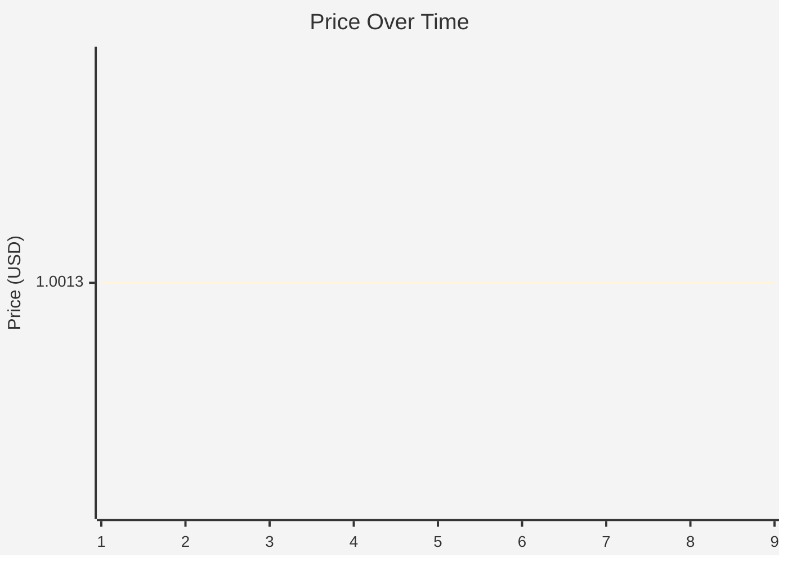
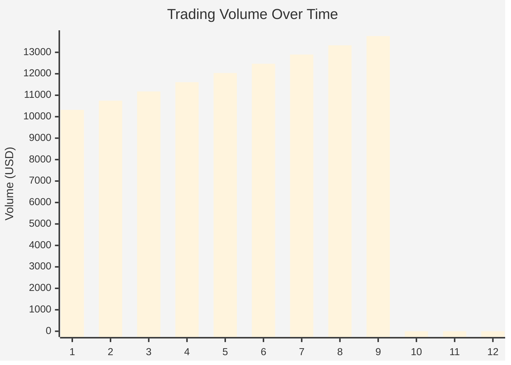

# Token Analysis Report: USDT 

**Token Name:** Tether   
**Chain:** Solana  
**Generated:** 2026-02-06 14:35:25 UTC  
**Contract:** `8XbMPqkoLpG8HeyJo47VBvoJ3zP1pkSCBfu4zD3QsjPM`

---

## Executive Summary

| Metric | Value |
|--------|-------|
| Price | $1.001300 |
| 24h Change | +0.00% |
| 7d Change | +0.00% |
| 24h Volume | $310K |
| 7d Volume | $2.17M |
| Liquidity | $6.61B |
| Market Cap | $185.94B |
| Fully Diluted Valuation | $185.94B |
| Total Holders | 0 |

---

## Price Analysis

**Current Price:** $1.001300

### Price Changes

| Period | Change |
|--------|--------|
| 24 Hours | +0.00% |
| 7 Days | +0.00% |

### Price Range (Period)

| Stat | Value |
|------|-------|
| High | $1.001300 |
| Low | $1.001300 |
| Average | $1.001300 |

### Price Chart

---

## Volume Analysis

| Period | Volume |
|--------|--------|
| 24 Hours | $310K |
| 7 Days | $2.17M |

**Volume/Liquidity Ratio (24h):** 0.00x

### Volume Chart

---

## Liquidity Analysis

**Total Liquidity:** $6.61B

### Trading Pairs

| DEX | Pair | Liquidity | 24h Volume | Price |
|-----|------|-----------|------------|-------|
| raydium | USDT /USDT | $6.61B | $310K | $1.001300 |

---

## Top Holders

*No holder data available*

---

## Concentration Analysis

- **Top 10 holders control:** -0.0% of supply
- **Top 50 holders control:** -0.0% of supply
- **Top 100 holders control:** -0.0% of supply

### Interpretation

- 🟢 **Low Concentration:** Top 10 holders control less than 25% of supply. Well-distributed ownership.

---

## Risk Indicators

### Positive Indicators

- 🟢 **Reasonable distribution** - No extreme concentration in top holders
- 🟢 **Good liquidity** - Sufficient depth for most trades
- 🟢 **Active trading** - Healthy trading volume

---

## Data Sources

- [Block Explorer (Solana)](https://solscan.io/token/8XbMPqkoLpG8HeyJo47VBvoJ3zP1pkSCBfu4zD3QsjPM)
- [DexScreener](https://dexscreener.com/solana/8XbMPqkoLpG8HeyJo47VBvoJ3zP1pkSCBfu4zD3QsjPM)
- [GeckoTerminal](https://www.geckoterminal.com/solana/pools/8XbMPqkoLpG8HeyJo47VBvoJ3zP1pkSCBfu4zD3QsjPM)

---

*This report was generated automatically. Always verify data from primary sources before making decisions.*
